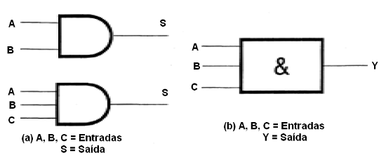
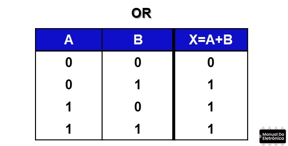
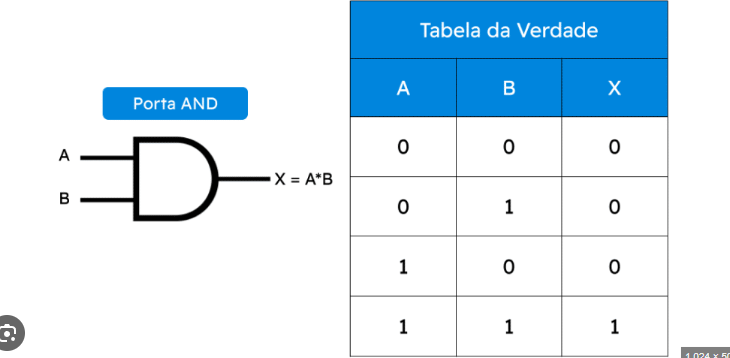
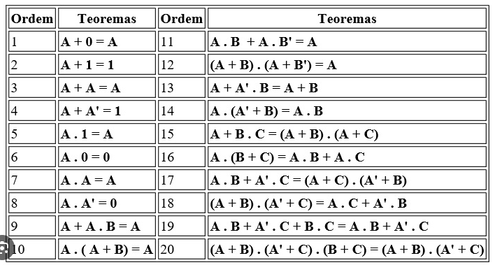

# Álgebra booleana

Formulada em 1847  por George Boole da Inglaterra (Considerado um dos fundadores da Ciência da Computação) e posteriormente refinadas por outros matematicos.
- Na Álgebra Booleana as variaveis envolvidas só podem assumir 2 valores possíveis, não importa o nome que se dê a eles: Verdadeiro ou ?Falso, Aberto ou fechado.

[SIMULIDE](https://simulide.com/p/download110/)  -> aPP EXECUTAVEL
[FALSTAD](https://www.falstad.com/circuit/) -> SIMULADOR DE CIRCUITO ONLINE

## Operação OU (Adição lógica ou OR)

S = A + B, onde o símbolo "+" representa a operação "OU"

- O resultado de um operação lógica  "OU" é verdadeiro (Nível 1) se uma OU outra variável relacionada é verdadeira.

Tabela Verdade: 

## Operação E (Multiplicação lógica ou AND)

S = A . B, onde o símbolo "." representa a operação "E"

## Operação de Inversão (Negação ou NOT)
    _
S = A , onde a barra representa a operação de inversão e lê-se 

# Teoremas de Boole 

Os teoremas da Algebra booleana contemplam algumas propriedades da álgebra de Boole.

São usados para reduzir uma expressão booleana.  

A expressão booleana reduzida deve ser equivalente à expressão booleana.

Teoremas de Boole: 
